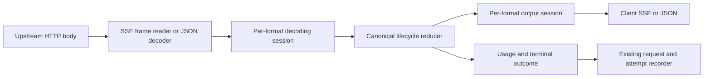

# Protocol streaming correctness: Hermes tool calls and adapter hardening

Date: 2026-09-12

Status: implementation of incident milestone in this checkout; deployment pending

Analyzed checkout: `cdb9760828e04373c44f6acbb40b6e6704ef5985`

Audience: implementer and reviewer

## 1. Decision

Make each upstream response a stateful decoding session. Preserve identity and lifecycle separately from incremental payloads, validate the resulting semantics, and encode a legal lifecycle in the client's protocol. Keep the existing three format adapters and canonical boundary. Introduce a shared response reducer and per-format stream sessions; no database migration or provider-specific Hermes exception is needed.

The immediate release must preserve function names, call IDs, and argument bytes across Responses → Chat Completions, including interleaved calls and final-snapshot recovery. A name-only patch is insufficient: it can still duplicate names/arguments, confuse item IDs with call IDs, or silently lose tools during non-stream conversion.

Implement in two milestones:

1. **Incident repair:** stateful Responses tool decoding, correct Chat encoding, shared tool reconciliation, terminal/error handling on this path, and proxy regression coverage.
2. **Adapter hardening:** apply the same contracts to every source/destination pair, request history, reasoning/content handling, resource limits, and diagnostics. Finish this milestone before claiming general translation compatibility.

## 2. Evidence and version boundary

The supplied [incident report](/Users/thinkuplater/Documents/Codex/2026-09-12/i/outputs/paylessforai-hermes-invalid-tool-call-fix.md) reports Hermes receiving a valid ID and arguments with an empty function name through Chat Completions → OpenCode Go Responses. It identifies deployment `e8fff2b2c1cdc034e0d27d1878c88e6d17f922bd`, with failures around 09:33 and 09:40 UTC. These production facts come from that report; live Hermes logs, deployment state, and raw upstream traffic were not rechecked for this design.

The local checkout is different. That deployed commit is unavailable in the local object database. This checkout's `decodeResponsesStreamDelta` treats every string `delta` as text, and `decodeResponseFor` buffers the entire body. Consequently, the report's precise incremental implementation cannot be described as verified current source here. The implementer must inspect the target release branch and port these contracts into its existing incremental reader if present; do not replace it with the older buffered code.

The report's proposed instructions were evaluated as design input, not executed as implementation or deployment authorization.

### Verified local reproductions

A temporary Go diagnostic called the public `wire.DecodeResponse` and `wire.EncodeResponse` with synthetic fixtures, then was removed. Results at the analyzed SHA:

| Input to Responses decoder; output to Chat encoder | Observed result |
| --- | --- |
| Added function item with `id=fc-1`, `call_id=call-1`, `name=tool_search`; argument delta; completed snapshot | Arguments appeared as assistant `content`; no streamed `tool_calls`; final snapshot produced an empty text chunk |
| JSON response with two separate function items | Only the first call survived; Chat emitted `type=function_call` and `finish_reason=completed` |
| Text SSE delta followed by clean EOF, with no terminal lifecycle event | Decoder accepted it and encoder emitted `[DONE]` as though the stream had finished |

These are pre-fix reproductions of related defects in this checkout, not reproductions against the reported deployed binary. Existing `go test ./internal/wire` passed with a writable temporary Go cache, demonstrating a coverage gap. The diagnostic printed observations rather than asserting future behavior; focused regression assertions now cover the incident path below.

## 3. Findings and scope

Paths below are repository-relative and line numbers refer to the analyzed SHA. Re-locate by function name on the implementation branch.

| Priority | Finding and source | Consequence | Required correction |
| --- | --- | --- | --- |
| P0 | Reported incremental decoder loses metadata; local `responses_adapter.go:392` classifies any string delta as text | Invalid tool invocation or arguments leaked into visible prose | Decode by event type; join metadata and payload in session state |
| P0 | `canonical.go:42,116` has one `ToolCall` payload for complete calls and deltas, without explicit start/end or source identity | Missing metadata, mistaken JSON parsing of fragments, ambiguous reconciliation | Separate complete call values from stream lifecycle events |
| P1 | `chat_adapter.go:402` returns at most one text/reasoning event and never reads streamed tools; `anthropic_adapter.go:361` only reads text deltas | Tools dropped; mixed fields can be lost | One input frame may produce zero, one, or many canonical events |
| P1 | All stream encoders (`chat_adapter.go:433`, `responses_adapter.go:423`, `anthropic_adapter.go:391`) output text-only shapes | Tool/reasoning/usage/snapshot events turn into empty text; missing protocol lifecycle | Stateful target encoders with exhaustive event handling |
| P1 | All full response encoders read only `Messages[0].ToolCalls`; Responses decoder creates a message per function item | Later tools silently disappear, including when text precedes a tool | Iterate ordered canonical items; never use the first message as the whole response |
| P1 | `chat_adapter.go:420` copies call type and finish reason; Responses always writes `status=completed` | Cross-protocol enums become invalid or unsuccessful output appears successful | Canonical call kind and stop outcome with explicit mapping |
| P1 | `canonical.go:585` parses individual lines, skips invalid JSON, has no terminal check; Anthropic full decoder accepts absent content as an empty message | Corrupt/truncated/error-only streams may appear successful | SSE framing, typed dispatch, terminal validation; no full-response fallback for arbitrary frames |
| P1 | `canonical.go:635` takes the first response snapshot; `:676` ignores encoding/write errors and unconditionally writes `[DONE]` | Early snapshots win; client disconnects can be recorded as success | Shared reducer, actual write outcome, per-protocol terminals |
| P1 | `EventStream.Stream` derives from upstream Content-Type; proxy passes it directly to encoding (`proxy.go:558,690`) | Client `stream=false` can receive SSE, or `stream=true` can receive JSON | Select downstream transport from the canonical client request |
| P1 | Responses accepts `custom_tool_call` but reads `arguments`, and request encoding rewrites tools/calls to functions (`responses_adapter.go:96,190,350`) | Custom input and tool semantics are silently changed | Preserve supported custom payloads or reject explicitly before calling upstream |
| P1 | Full Responses decoding ignores content decode errors; reasoning summary items are not decoded as reasoning; full encoders mostly flatten to text | Unsupported content and reasoning silently disappear | Preserve representable semantics and raise typed incompatibility for the remainder |
| P2 | `proxy.go:484` holds a route format mutex through network read and downstream write | Same-route streams serialize behind slow clients | Lock discovery/persistence only; known-format streams run concurrently |
| P2 | `decodeResponseFor` uses unbounded `io.ReadAll`; sparse usage uses nonzero replacement | Memory grows with response size; absent and explicit zero cannot be distinguished | Bounded incremental reader and presence-aware usage fields |

The `Tools=false` catalog observation is separate. `TestMatchDoesNotGateRoutesOnToolMetadata` explicitly verifies that sparse tool metadata does not block a route. Preserve that behavior in this repair. A later capability-discovery change should distinguish unknown from explicitly unsupported and should have its own evidence and migration decision.

## 4. Correct the incident fixture and identity model

Responses exposes both an output item ID and a tool call ID. Argument events refer to the item ID; the call ID connects a tool invocation to its subsequent result. The official example shows different values. [OpenAI function calling](https://developers.openai.com/api/docs/guides/function-calling#streaming)

Use this stronger synthetic regression fixture, rather than only the report's equal-ID example:

```text
event: response.output_item.added
data: {"type":"response.output_item.added","output_index":0,"item":{"type":"function_call","id":"fc-1","call_id":"call-1","name":"tool_search","arguments":""}}

event: response.function_call_arguments.delta
data: {"type":"response.function_call_arguments.delta","item_id":"fc-1","output_index":0,"delta":"{\"name\":"}

event: response.function_call_arguments.delta
data: {"type":"response.function_call_arguments.delta","item_id":"fc-1","output_index":0,"delta":"\"hermes-agent\"}"}

event: response.function_call_arguments.done
data: {"type":"response.function_call_arguments.done","item_id":"fc-1","output_index":0,"arguments":"{\"name\":\"hermes-agent\"}"}

event: response.output_item.done
data: {"type":"response.output_item.done","output_index":0,"item":{"type":"function_call","id":"fc-1","call_id":"call-1","name":"tool_search","arguments":"{\"name\":\"hermes-agent\"}"}}

event: response.completed
data: {"type":"response.completed","response":{"id":"resp-1","model":"test-model","status":"completed","output":[{"type":"function_call","id":"fc-1","call_id":"call-1","name":"tool_search","arguments":"{\"name\":\"hermes-agent\"}"}],"usage":{"input_tokens":10,"output_tokens":5,"total_tokens":15}}}
```

Required assembled client result: exactly one function call, `id=call-1`, `name=tool_search`, arguments exactly `{"name":"hermes-agent"}`. `hermes-agent` is an argument value, never a candidate function name. Target Chat tool index is `0`; it is not derived from a numeric suffix in either ID.

## 5. Internal architecture and contracts



### 5.1 Session boundary

Codec factories remain reusable and stateless. Mutable maps and buffers belong to one response attempt. Retries allocate fresh sessions; cancellation closes the body and releases all state. Avoid global tool maps, new services, and persisted stream fragments.

Proposed API shape (names may adapt to the newer branch; responsibilities must remain):

```go
type Frame struct {
    Event string
    ID    string
    Data  []byte
}

type StreamDecoder interface {
    Push(Frame) ([]Event, error)
    End() ([]Event, error) // EOF validation, never implicit success
}

type StreamEncoder interface {
    Push(Event) error
    Finish(Outcome) error
}
```

Add constructors taking format, context, and limits. A synchronous read → decode → reduce → encode loop supplies backpressure and avoids an unbounded event channel. Keep public buffered helpers as compatibility wrappers over the same reducer. If the release branch already has a callback/iterator interface, extend it instead of adding a parallel execution path.

Downstream stream mode is an explicit input from `Request.Options.Stream`. JSON upstream can be adapted into a complete legal SSE lifecycle; SSE upstream can be reduced into one JSON response. The latter necessarily buffers the completed semantic response within configured limits.

### 5.2 Canonical event additions

Use explicit `response_start`, `tool_start`, `tool_arguments_delta`, `tool_end`, content/reasoning delta, usage snapshot, and terminal outcome events. Migrate old `EventToolCallDelta` producers and consumers together. Keep complete `ToolCall.Arguments` separate from partial fragments, which are strings or byte slices, not `json.RawMessage` values assumed to be valid JSON.

Each tool event carries an immutable session-local key. A tool start carries `CallID`, normalized kind `function`, and non-empty name. Argument events carry only the key and fragment; metadata is not re-sent as a name delta. Track source item ID and source ordinal in the decoder, target ordinal in the encoder. This prevents target protocols from accidentally inheriting upstream indexing rules.

Preserve ordered content/tool/reasoning items in the reducer. Reuse existing canonical structures where possible, but add an explicit ordered item list if `Messages` cannot preserve interleaving. Do not keep independently mutable `Response.Text`, `Messages`, and tool lists: derive flattened text and legacy views from one authoritative representation.

Terminal outcome must distinguish normal stop, tool handoff, token limit/incomplete, refusal, upstream failure, protocol failure, and client cancellation. Usage is a sparse snapshot with presence flags/pointers, not a sum of lifecycle events.

### 5.3 Per-source association

| Source | Decoder key and rules |
| --- | --- |
| Responses | Primary `item.id` / delta `item_id`; retain `call_id` separately. Optional call-ID alias only when unambiguous. Missing item ID may use a unique call-ID alias. Missing both identities is malformed for tools. Retain `output_index` to preserve source ordering and detect contradictions, not as an accidental substitute for a supplied item ID. |
| Chat | `(choice.index, tool_calls[].index)` because continuation chunks often omit ID/name. Capture metadata from chunks that supply it. Handle every tool in an array. Initially accept one choice and explicitly reject multi-choice requests/responses until the canonical response supports them. |
| Anthropic | `content_block.index` for start/delta/stop, plus `tool_use.id` captured at start. The empty start `input` is a placeholder when JSON deltas follow. |

The report's “never use array position” principle means never use incidental slice position to join Responses calls. It must not prohibit Chat's and Anthropic's explicit protocol indices.

## 6. Responses tool state machine

Store for each tool: source identities, resolved call ID/name/kind, ordinal, accumulated arguments, emitted-prefix length, metadata-ready flag, started/closed flags, and pending byte count.

| Event | Required behavior |
| --- | --- |
| `response.output_item.added` | Inspect item type. Upsert function metadata. Resolve pending deltas. Emit one start when name and stable call ID are known, then flush pending fragments. Treat non-empty initial arguments as a snapshot, not an unconditional append. |
| `response.function_call_arguments.delta` | Associate by item ID. Append the exact fragment once. If metadata is unknown, retain it within limits. Never emit a blank-name tool start or reinterpret it as text. |
| `response.function_call_arguments.done` | Reconcile full arguments with the accumulated/emitted prefix. This alone may not contain complete identity metadata; retain state until the item can be closed. |
| `response.output_item.done` | Reconcile metadata and arguments; emit any missing suffix; validate and close the call exactly once. Retain enough state to reconcile the final response without replay. |
| `response.completed` | Visit all output items, recover unseen calls and missing metadata, compare known calls, close all valid calls, merge final usage, then emit one successful terminal outcome. Snapshot-only providers are supported. |
| `response.failed`, `response.incomplete`, `error` | Preserve the actual outcome; never synthesize a completed response. Token-limit incomplete is distinct from network/protocol corruption. |

Metadata fallback: use `call_id`, else item `id`, for the eventual client ID. If a later event introduces a different explicit call ID before start emission, prefer it. If identity or name changes after emission, fail with `tool_metadata_conflict`; never rewrite an invocation already visible to a client. Repeated identical metadata is harmless.

If the added event is late, buffer this tool's arguments; unrelated text may continue. Flush this tool's pending fragments only after a valid start. If metadata never becomes available by finalization, return `missing_tool_metadata`. Do not invent a function name or use Hermes' `invalid_tool_call` sentinel.

### Snapshot reconciliation algorithm

Let `A` be accumulated argument bytes, `E` the bytes already emitted, and `S` a complete argument snapshot.

1. If `S == A`, emit nothing.
2. If `S` starts with `A`, append only the missing suffix and emit it if started.
3. If no arguments have been emitted, an authoritative complete snapshot may replace pending `A`; record a recovery diagnostic.
4. If `S` conflicts with emitted bytes, fail `tool_snapshot_conflict`. Never append the whole snapshot, silently truncate, or retract output.
5. If a closed tool receives an identical snapshot, do nothing; a conflicting snapshot is an error. A completed tool should not receive new argument deltas.

Apply the same prefix discipline to text/reasoning snapshots so completion does not duplicate prior deltas. Do not deduplicate fragments by their contents: repeated equal fragments can be legitimate. Duplicate event IDs/sequence numbers may be suppressed only when the identifier and payload are identical; conflicting reuse is malformed. Do not require contiguous sequence numbers because ignorable events can exist between semantic events.

At tool close, validate non-empty identity/name and syntactic JSON for function arguments. Do not validate fragments or repair invalid JSON. Preserve whitespace and exact argument bytes. A valid argument object violating the declared schema remains model output for the client to assess; translation must not invent corrected arguments. Truncated JSON caused by a token limit must never yield a successful tool handoff. Custom tool input requires a separate text payload contract rather than JSON parsing.

## 7. Target encoding requirements

### Chat Completions

Allocate a stable zero-based target tool index per canonical key. Emit ID, `type=function`, and full name once on start. Later chunks include that index and argument fragments only. Never send `function_call` as Chat's function type, or re-send the full name on every fragment: SDK accumulators may concatenate names.

```json
{"choices":[{"index":0,"delta":{"tool_calls":[{"index":0,"id":"call-1","type":"function","function":{"name":"tool_search","arguments":""}}]},"finish_reason":null}]}
```

Subsequent deltas carry `function.arguments`; successful tool handoff ends with `finish_reason=tool_calls`. Normal completion uses `stop`; token limit uses `length`. Output actual response ID/model consistently across chunks. Include initial assistant role, requested usage trailer, and one `[DONE]` only after a successful/incomplete protocol lifecycle has been encoded. Preserve mixed assistant text and tools rather than forcing text to null whenever tools exist.

### Responses

Own response and output-item lifecycle: created/in-progress as supported by the contract, item added, typed content/argument deltas, argument/content done, item done, and final response snapshot. Maintain distinct output item ID and call ID, legal ordinals, and sequence numbers required by the selected schema. Preserve a supplied item ID; generate a session-local output item ID only for translation from another protocol.

Do not use a universal Chat `[DONE]` terminator. Emit `response.completed`, `response.incomplete`, or a failure event consistent with the canonical outcome. Build the final output from all canonical items, without streaming the snapshot content a second time.

### Anthropic Messages

Emit `message_start`, indexed content block starts/deltas/stops, `message_delta` with mapped stop reason/usage, and `message_stop`. Function tools use `tool_use` at block start and `input_json_delta.partial_json` for fragments. Thinking uses its own blocks/deltas and preserves signatures when available; it is never emitted as visible text. This lifecycle and indexed block association are part of the documented contract. [Anthropic streaming](https://platform.claude.com/docs/en/build-with-claude/streaming)

Use `tool_use`, `end_turn`, and `max_tokens` for corresponding outcomes, with no Chat `[DONE]` sentinel. Serialize complete tool input as a JSON object when required by the target; incompatible custom/text input gets a typed error.

### Stop and feature compatibility

Keep response lifecycle status separate from tool handoff. A completed Responses function item maps to Chat `tool_calls`, not `completed`. Failure is never mapped to normal stop. Unknown stop enums must produce a diagnostic and explicit incompatibility rather than silently becoming success.

All full-response and stream encoders must handle all canonical event/item kinds or return `IncompatibilityError`. Known unsupported semantic content cannot be dropped. Ignore only explicitly classified nonsemantic events (for example keepalives); unknown semantic item types require an error. Preserve existing supported image/audio/file request behavior with regression tests. For custom tools, built-in provider tools, opaque reasoning, and generated audio/image content, implement a verified mapping or return a precise incompatibility; do not claim universal fidelity.

## 8. Reader, transport, errors, and proxy integration

Use a bounded SSE frame reader that handles LF/CRLF, comments, blank-line frame termination, multiple `data:` lines joined with newline, UTF-8 split across network reads, and optional event/ID fields. Dispatch on JSON type and SSE event name; if both are present and contradictory, report a protocol error. Do not fall back to full JSON response decoding for every lifecycle frame. Known malformed semantic frames fail; unknown keepalives do not corrupt active calls.

Initial proposed defaults: 8 MiB per SSE frame, 4 MiB arguments per call, 16 MiB unresolved-tool bytes per response, 64 MiB retained aggregate response, and 128 calls per response. Expose one internal limits struct and use tiny limits in tests. These are engineering defaults, not protocol maxima; calibrate with large code-tool traces before promotion. On overflow return `translation_limit_exceeded`, never discard bytes. No new settings UI is required.

| Situation | Proxy action |
| --- | --- |
| Local request/destination incompatibility | Reject that candidate before network I/O; preserve normal attempt-budget policy |
| Malformed upstream before any downstream commitment | Existing bounded retry/failover may run; record upstream HTTP status separately from semantic failure |
| Valid stream identified but tool metadata pending | Continue reading within limits; do not send a malformed tool event |
| Error after downstream headers/body were committed | No retry or format probe; emit target error if possible, close, record partial/failed outcome |
| Client write failure or cancellation | Cancel upstream immediately; stop writing; record disconnect/cancellation separately from upstream protocol failure |
| EOF before required terminal | `truncated_stream`, even if the socket ended cleanly; no success marker |
| Terminal success with repeated final usage | Persist usage once using presence-aware snapshots |

Track HTTP commitment at the writer boundary; decoded events are not evidence that bytes reached the client. An attempted write that errors may have delivered bytes and must prohibit replay. Do not eagerly send success headers before output is ready. For the old buffered path, receiving data internally is not a reason to replay a partial response with a success terminator.

Define the Chat streaming-error extension explicitly: emit a top-level `error` JSON SSE object, no successful finish reason or `[DONE]`, then close. Responses and Anthropic use their native error envelopes. Downstream SDK behavior must be tested; network errors can prevent even an error envelope from being delivered.

Retain `recordProxyAttemptRoute`, `RecordWithHTTPStatus`, and existing format diagnostics. Reuse request/attempt status and error fields. Suggested error codes: `missing_tool_metadata`, `tool_metadata_conflict`, `tool_snapshot_conflict`, `invalid_tool_arguments`, `malformed_stream_event`, `truncated_stream`, `translation_limit_exceeded`, `client_write_failed`.

Capture request ID, attempt, provider/client format, event type, unresolved-call count, byte counts, recovery count, terminal outcome, and actual upstream HTTP status. Do not log arguments, prompts, or credentials by default. Preserve observed usage for partial attempts where supported; missing usage remains unknown and must not be presented as confirmed zero. Do not mark the request succeeded until encoding and terminal handling succeed.

Only endpoint/format evidence should clear or change a learned route format. A malformed tool in a recognizably valid Responses stream is not evidence that the endpoint speaks another format. Adapt `shouldTryNextFormat` so protocol-content failure does not trigger endpoint probing. Preserve existing unknown-format discovery tests.

Reduce `routeFormatLock` scope: read known format without holding the mutex for inference; for unknown format, coalesce discovery and recheck after acquisition, then release once format is established. Never hold a route mutex while writing a long-lived client stream.

## 9. Request/history audit required alongside response changes

Tool calls must survive the next user-agent round trip, not just the first response. Add a fixture containing two assistant calls followed by two results and another model turn. Preserve each call/result ID and the assistant text around them across all supported formats.

Audit `decodeResponsesPayload`, `encodeResponses`, `decodeChatToolCalls`, and `encodeAnthropic`. Specifically:

- Normalize function kinds internally and map them at each boundary.
- Do not force custom tools into function schemas or read custom text from the function `arguments` field.
- Encode Responses reasoning as valid reasoning items rather than unverified reasoning blocks inside message content; retain opaque fields only where the target supports them.
- Propagate `decodeStringOrBlocks` errors instead of ignoring them.
- Reject unsupported multi-choice semantics before losing all but the first choice.
- Keep per-attempt request encoding immutable; retry must not concatenate tool history or mutate the source request.

Full cross-protocol opaque reasoning replay and provider-native tools may need dedicated follow-up work. Explicit incompatibility is required in the meantime, so unsupported features cannot silently masquerade as working translation.

## 10. Implementation work packages

| Step | Files / boundaries | Reviewable deliverable |
| --- | --- | --- |
| 1 | Target branch and sanitized fixtures | Record target SHA; capture incident-shaped SSE with distinct IDs; tests asserting expected client result fail before the fix |
| 2 | `internal/wire/canonical.go`, new `stream_state.go` | Tool lifecycle types, identity/prefix reducer, terminal outcome, presence-aware usage, bounded state |
| 3 | `responses_adapter.go`, `chat_adapter.go` | Incident path works incrementally and as JSON; snapshots do not replay; all calls survive; legal types/reasons |
| 4 | `internal/proxy/proxy.go` | Explicit client stream mode, writer commitment and error propagation, diagnostics and failover gates |
| 5 | New `sse.go`, all three adapters, `codec.go` | Shared framing and per-response sessions; complete target lifecycles; no generic text fallback |
| 6 | Request codecs and compatibility validation | History round-trip, reasoning/content guards, custom-tool and multi-choice explicit handling |
| 7 | Proxy and E2E fixtures/tests | Full deterministic matrix, failure paths, cancellation and bounded-memory coverage |

Keep production changes out of this documentation task. The implementation should update this document with its target SHA and any negotiated compatibility limits.

## 11. Verification specification

### Focused regressions

| ID | Fixture | Assertions |
| --- | --- | --- |
| T01 | Section 4 fixture | Exactly one `tool_search`, original call ID, exact argument bytes, no argument text leak, correct finish reason |
| T02 | Two calls, interleaved deltas; text is output item 0 | Distinct stable client indices; no merge/drop; call index does not inherit text index |
| T03 | Split/empty fragments, Unicode, escaped quotes, repeated equal fragments | Exact concatenation; no per-fragment JSON parsing or content-based deduplication |
| T04 | Missing call ID; item ID present | Consistent documented fallback in start, completion, and next-turn history |
| T05 | Deltas before added; completed-only; item-done-only metadata | Recovery before start; pending data bounded; no duplicate invocation |
| T06 | Arguments done + item done + completed all repeat content | No duplicated arguments, names, text, or tools |
| T07 | Conflicting identity/snapshot; missing name at terminal; missing IDs | Typed failure, never successful invalid invocation |
| T08 | JSON response with text then two tools; mixed text/tools | Every call preserved; valid target type/status and mixed content |
| T09 | Chat chunk containing text, reasoning and multiple tools | All supported fields processed; continuations associate by explicit index |
| T10 | Anthropic tool start, JSON fragments, stop; thinking/signature | Correct identity and lifecycle; placeholder `{}` not prepended to fragments |
| T11 | EOF, in-band error, failed/incomplete lifecycle, token-limit JSON truncation | Correct outcome; no forged successful finish; no failover after commitment |
| T12 | CRLF, multiline data, keepalive, malformed semantic JSON, conflicting event/type | Correct frame parsing and strict semantic errors |
| T13 | Usage start/delta/final, explicit zero, cache/reasoning details | Correct final values without summing snapshots or losing cache semantics |
| T14 | Slow writer, cancellation, writer failure, exceeded limits | Prompt upstream cancellation, bounded retained state, no success record |
| T15 | Simultaneous same-route requests and repeated IDs across requests | No shared state and no known-format route serialization |
| T16 | Two-call/tool-result round trip; unsupported custom tool/content/multi-choice | Preserve supported semantics or return precise incompatibility without upstream mutation |

For each source in Chat, Responses, Anthropic and each target in the same set, exercise all four transport combinations: JSON→JSON, SSE→SSE, SSE→JSON, JSON→SSE. That is 36 protocol/transport cells for supported text + function-tool semantics. Apply usage/outcome fixtures throughout; unsupported feature cells must assert typed incompatibility, not be skipped silently. Same-format traffic through the canonical path is part of the matrix.

The primary oracle must be the serialized client response reconstructed by a small independent protocol accumulator or a pinned client SDK. Do not assert only internal event structs or use the same reducer as both implementation and oracle. Add SDK smoke checks for Chat tool aggregation and target lifecycle parsing.

### Proxy / binary integration

Extend `internal/proxy/proxy_test.go` with an `httptest` Responses provider. Send a real Chat request with `stream=true` and a function definition for `tool_search`; assert the encoded upstream request, assembled client tool, request formats/status/usage, and zero fallback requests after commitment. Repeat with client `stream=false` and an SSE upstream.

Use a channel-gated fake provider: flush metadata and one argument fragment, wait until the client observes it, then send the rest. This deterministically proves incremental delivery without brittle sleep-based latency assertions. A second test gates the provider on request cancellation to verify cleanup.

Extend `test/e2e/translation.spec.ts` and `test/e2e/mocks/translation/` with SSE fixtures and a two-turn tool workflow. If the mock cannot pace frames, add pacing support or use the Go fake provider for that case. Existing text/route-discovery fixtures are not sufficient tool coverage.

Implementation release gates, matching repository CI:

```sh
go test ./internal/wire ./internal/proxy
go test -race ./...
go vet ./...
CGO_ENABLED=0 go build -o /tmp/paylessforai-stream-candidate ./cmd/paylessforai-app
git diff --check
```

Run `npm test -- translation.spec.ts` from `test/e2e` after installing dependencies and Chromium as in `.github/workflows/e2e.yml`. `playwright.config.ts` starts the application and three mock providers automatically. Because it permits server reuse and uses `/tmp/paylessforai-e2e`, verify that reused services and database state belong to this test run. Run the built candidate against the fake provider and save redacted wire transcripts plus the build SHA as release evidence. Do not label proposed tests as passed until they run.

## 12. Rollout and acceptance

Before promotion, finish the incident-path gates, retain a known-good binary, and document whether the target already has incremental streaming. Do not use this checkout as a blanket rollback for the reported build: it has independently reproduced translation defects.

After promotion, verify the active binary revision and replay a harmless Hermes request that requires `tool_search` through the same Chat-client/Responses-provider route. Verify a non-empty exact function name and matching result ID, successful execution, no empty-name sanitizer warning for that request, and one final Telegram answer. These are future release checks; this task did not send messages or deploy.

Rollback if valid tool calls are lost/corrupted, argument bytes duplicate, errors appear as success, or clients receive repeated output. A previously working direct native Responses connection can be an operator-controlled temporary workaround only after verifying that exact route; it is not the translation fix.

The implementation is accepted when T01–T16 pass at the required milestone, every supported matrix cell has client-visible assertions, production Hermes verification passes, and all request/attempt outcomes reflect actual delivery. Report incident repair and complete adapter hardening as separate completion states.

## 13. Design validation performed

- Read the supplied incident report and the local canonical codec, three adapters, proxy integration, matcher behavior, and relevant tests/CI.
- Verified the checkout SHA and the absence of the reported deployment SHA in the local Git object database.
- Ran the existing wire test suite successfully with `GOCACHE=/tmp/paylessforai-design-go-cache` after the default cache path was sandbox-blocked.
- Ran and removed the temporary three-fixture diagnostic described in section 2.
- Consulted official [OpenAI function calling](https://developers.openai.com/api/docs/guides/function-calling), [OpenAI streaming guidance](https://developers.openai.com/api/docs/guides/streaming-responses), and [Anthropic streaming](https://platform.claude.com/docs/en/build-with-claude/streaming) for protocol contracts. Provider ordering variations and buffer defaults above are proposed compatibility policies, not guarantees made by those specifications.
- Incident milestone implementation is present in `internal/wire/canonical.go`, `responses_adapter.go`, `chat_adapter.go`, and associated tests. Full adapter hardening, SDK compatibility checks, remote CI, deployment, and live Hermes validation remain outstanding.
